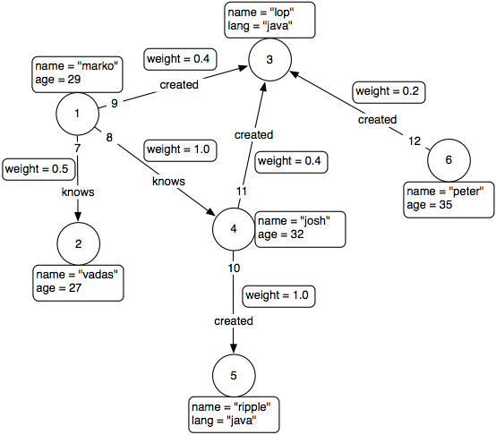

## CMSC 498O: Graph Data Management

- Goal: Manage graph-structured data, i.e., data containing a set of entities and interconnections between them, and/or execute various types of network analysis queries over them

- See [PDF Slides](graphs.pdf) for an overview of Graph Data Management

- Specific graph analytics techniques discussed in class:
    - [PageRank](http://en.wikipedia.org/wiki/PageRank) -- the above slides also have a detailed description
    - [Betweenness Centrality](http://en.wikipedia.org/wiki/Betweenness_centrality): Only the basic idea, not the algorithms
    - [Community Detection](http://en.wikipedia.org/wiki/Community_structure): Some basic intuitions about it

- Vertex-centric programming framework 
    - Originally used by Google's Pregel System, and now adopted (with some variations) by many other systems including Giraph, GraphLab, etc.
    - The above slides contain a basic overview
    - For more details, see the [original Pregel Paper](http://dl.acm.org/citation.cfm?id=1807184)

- GraphX programming framework
    - GraphX is based on Spark and hence on Map-Reduce
    - The core primitive is mapReduceTriplets, which enables an edge-centric programming framework, which in turn can be used to simulate vertex-centric programming framework
    - See [Lab 9](https://github.com/umddb/datascience-fall14/tree/master/lab9) for more details

- Graph Data Models
    - [Property Graph Model](https://github.com/tinkerpop/blueprints/wiki/Property-Graph-Model)

    - [Resource Discription Framework (RDF)](http://en.wikipedia.org/wiki/Resource_Description_Framework)

    - Several other models have been proposed, but not in use (as far as I know)

- Types of queries/tasks of interest
    - Subgraph pattern matching: Find matching instances of a given small graph in a large graph
        - Although technically NP-Hard, usually the patterns are small 
    - Shortest path queries (e.g., in road networks)
    - Reachability: are two nodes connected?
    - Keyword proximity Search: find the smallest subgraph connecting a set of given keywords
    - Graph algorithms: matching, network flows, spanning trees, etc...

- Query Languages for Graph Databases
    - Neo4j Cypher: See Lab 9
    - [Gremlin](https://github.com/tinkerpop/gremlin/wiki): A relatively low-level graph traversal languages
    - [SPARQL](http://en.wikipedia.org/wiki/SPARQL): The query language for RDF data/Semantic Web
        - This is an excellent resource: [Tutorial with Examples](http://www.cambridgesemantics.com/semantic-university/sparql-by-example) 
    - Neo4j and SPARQL are based on subgraph pattern matching, and cannot easily handle queries like *reachability*

- Storing Graph Data
    - Graph data can typically be stored in relation databases, if the data is sufficiently structured
        - Each node type is stored in a separate relation
        - Each edge type is stored in a separate relation
        - Very similar to how you would do this for the Entity-Relationship Model
        - Can convert graph queries into SQL in some cases
            - Not always possible or easy
            - Typically does not give you good performance because of a large number of joins

    - Many specialized graph database systems in recent years
        - Neo4j, Titan, OrientDB, DEX, Datomic (although it doesn't call itself that)
        - Also, many RDF stores support graph queries/analysis, e.g., AllegroGraph
        - An extensive list at the [Wikipedia Article](http://en.wikipedia.org/wiki/Graph_database)

    - A few key distinctions from relational databases
        - Support a graph query language like SPARQL, Cypher, Gremlin, or others
        - Store the graph structure explicitly as pointers
            - Avoid the need for joins, making graph traversals easier
            - More natural to write queries like *reachability* or *shortest paths* or other graph algorithms
        - Expose a programmatic API to write arbitrary graph algorithms

- Some graph database systems
    - [Neo4j](http://neo4j.com/)
        - Perhaps the most mature graph database (AllegroGraph is also quite mature, but usually not thought of as a graph database)
        - Function-rich: Supports ACID transactions, Cypher query language, and programmatic API
        - Several performance-related issues pointed out in recent works
        - Meant primarily for a single-machine deployment -- recent efforts to allow distributed processing
    - [Titan](http://thinkaurelius.github.io/titan/)
        - Stores data in a distributed Cassandra Cluster
        - Quite function-rich already, but rapidly evolving and not as mature yet
    - [OrientDB](http://www.orientechnologies.com/orientdb/)
        - Perhaps the most function rich since it is both a Document database (like MongoDB) and a graph database
        - Not as widely adopted at this point
    - [AllegroGraph](http://franz.com/agraph/allegrograph/)
        - A wide range of functionality for RDF data management, including social network analysis tools
        - Not open-source (unlike the others)
        - Does not expose an explicit graph data model or a graph query langauge, but rather SPARQL
