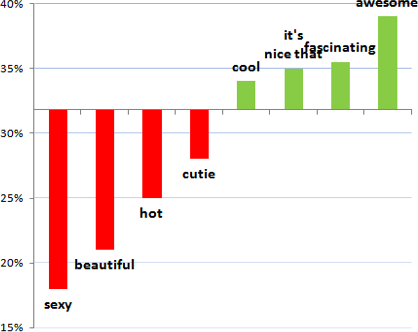
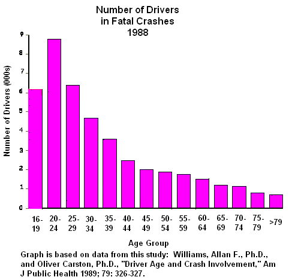
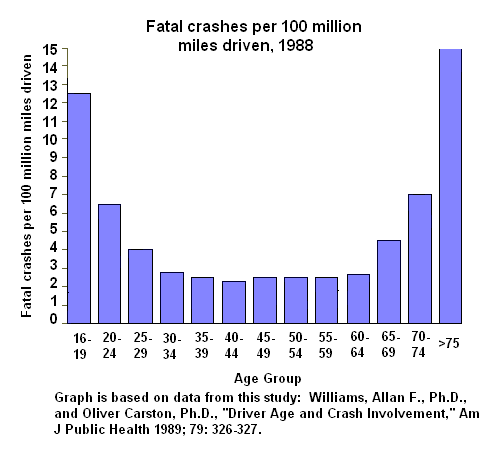

---

# CMSC 498O: Basic Probability and Statistics
 

---

## Stuff

- Sign up for Piazza !!
    - Only 15 signed up so far...
- No laptops in the class.. unless we are doing in-class labs.
    - If you want to use it to take notes, come talk to me.
- Lab 0 is not graded.
- Questions about last class? About assignment?
- Today:
    - Basic probability and statistics
    - Material borrowed from these slides: [Crash Course in Statistics](http://astro.sunysb.edu/steinkirch/reviews/stats.pdf)

---

## Statistical Inference

- Statistical inference is the discipline that concerns itself with the development of procedures, methods, and theorems that allow us to extract meaning and information from data that has been generated by stochastic (random) processes.
    - Process of going from the world to the data, and then back to the world
    - Often the goal is to develop a statistical model of the world from observed data
- Conclusion is typically:
    - an estimate; 
    - or a confidence interval; 
    - or rejection of a hypothesis
    - or clustering or classification of data points into groups

    
--- 

## Basic Probability

- Probability is concerned with the outcome of a *trial* (also called *experiment* or *observation*)
- Sample Space: Set of all possible outcomes of a trial
    - Probability of Sample Space = 1
- Event is the **specification** of the outcome of a trial
    - For example: **Trial** = Tossing a coin; **Sample Space** = {Heads, Tails}; **Event** = Heads
- If two events E and F are independent, then: 
    - Probability of E does not change if F has already happend = P(E), i.e., P(E | F) = P(E)
    - Also: P(E AND F) = P(E) * P(F)
- If two events E and F are mutually exclusive, then: P(E UNION F) = P(E) + P(F)
- P(E UNION F) + P(E AND F) = P(E) + P(F)
- Bayes Theorem
    - P(A | B) = P(B | A) * P(A) / P(B)
    - Simple equation, but fundamental to Bayesian inference
- Conditional Independence: A and B are conditionally independent given C if:
    - Pr(A AND B | C) = Pr(A | C) * Pr(B | C)
    - Powerful in reducing the computational efforts in storing and manipulating large joint probability distributions
- Entropy
    - A measure of the uncertainty in a probability distribution
    - [Wikipedia Article](http://en.wikipedia.org/wiki/Entropy_%28information_theory%29)

--- 

## Terms/Definitions

- Types of data: 
    - Quantitative: Discrete vs Continuous
    - Categorical (e.g., Zipcodes): no inherent order among the values
- Random error vs Systematic error: the former will get cancelled out with enough measurements
- Populations vs Samples
    - Population: any set of objects or units under consideration
        - *N* typically represents the total number of observations in the population
    - Sample: a subset of the data
        - *n* typically used to represent the number of samples
- Aspects:
    - Sampling effective at reducing the data you need to analyze
    - Ideally you want **random** sample
        - Otherwise you need to account for bias, which can be tricky
    - Bias in sampling: need to be very careful when generalizing inferences drawn from a sample
        - Even for random samples

--- 

## Some Potential Sources of Biases

- Sample Bias
    - Selection bias: some subjects more likely to be selected
    - Volunteer bias: people who volunteer are not representative
    - Nonresponse bias: people who decline to be interviewed
- Information Bias
    - Interviewer bias 
    - Social desirability bias: people are not going to admit to embarrassing things
- Questions to ask:
    - How was the sample selected? Was it truly random? Potential biases?
    - How were questions worded? How is missing data/attrition handled? 
    - Was the sample size large enough? 
- Also watch out for:
    - Confirmation bias
    - Anchor bias

---

## Some Potential Sources of Biases

- Gold Standard: Randomized Clinical Trials
    - Some people receive "treatment", others in a "control" group
    - Picked randomly to take care of all confounding factors
    - Problems:
        - Ethically feasible only if **clinically equipose**
            - Can't ask some people to smoke to figure out the effects of smoking
        - Very expensive and cumbersome
        - Impossible in many cases
    - Recall: Recent Facebook experiment on emotions
    - OKCupid also admits to doing some testing like this

--- 

## Definitions

- Mean: numerical average of things
    - Often not very useful because of skew
    - Is heavily influenced by outliers
- Median: the middle value after ordering them
    - Considered the most representative
- Mode: most frequently occurring value
    - Useful for categorical data, where mean and median are not meaningful
- Variance:
    - Measure of dispersion -- provides an estimate of the average difference of each value from the mean
    - See [Wikipedia](http://en.wikipedia.org/wiki/Variance#Population_variance_and_sample_variance) for formulas
    - Slightly different formulas for sample vs population
- Standard deviation:
    - Square root of variance

--- 

## Normal Distribution

- 99.7% values will fall within 3 standard deviations (around the mean)
    - 95% for 2 standard deviations; 68% for 1
- **Central Limit Theorem**: As sample size approaches infinity, distribution of sample means will follow a normal distribution irrespective of the original distribution

---

## Confidence Intervals

- *Point estimate:* a single statistics or parameter that we are trying to estimate for a population 
    - e.g., mean of the population
- When we give a confidence interval [a, b] with confidence level 95%:
    - If we were to repeatadly draw samples from the population, 95% of the time, the true mean of the population will lie in the range computed from the sample
    - Confidence is in the method to compute the interval, not the interval itself
- Factors:
    - Higher confidence level --> bigger interval
    - Higher variability --> bigger interval
    - Higher number of samples --> smaller interval
        - Inverse square root relationship

--- 

## Hypothesis Testing

- [Nice examples of Hypothesis Testing](http://www.unc.edu/~blopes/files/stat11spring03/Files/HypothesisTesting.pdf)
- H_0 is called the *null hypothesis*, and H_1 is the *alternative hypothesis*
    - Mutually exclusive and exhaustive
    - H_0 can never be proven to be true
- Statistical significance: probability that the result is not due to chance
- Process:
    - Decide on H_0 and H_1
    - Decide which *test statistic* is appropriate
        - Key question: what is the distribution of the test statistic over samples?
    - Select a significance level (\sigma), a probability threshold below which the null hypothesis will be rejected -- typically 5% or 1%.
    - Compute the observed value of the test statistic t_obs from the sample
    - Compute **p-value**: the probability that the test statistic took that value by chance
        - Use the distribution above to compute the *p-value*
    - Reject the null hypothesis if the *p-value < \sigma*

---

## Hypothesis Testing

- Type 1 Error: Rejected null hypothesis by mistake
- Type 2 Error: Accepted null hypothesis by mistake
- Common Test Statistics
    - One-sample Tests: Appropriate when comparing a sample to the underlying population
    - Two-sample Tests: When comparing two samples, e.g., experimental and control
- [Wikipedia article](http://en.wikipedia.org/wiki/Statistical_hypothesis_testing) has a lot more details on different types of tests
    - Along with history of hypothesis testing, debates about it, criticisms, etc.

---

## Hypothesis Testing

- If multiple tests are carried out, some are likely to be significant by chance alone

---

## Scientific method: Statistical Errors

- [Nature Article](http://www.nature.com/news/scientific-method-statistical-errors-1.14700)
- P values not as reliable as many scientists assume
- Issues:
    - A p-value of 0.01 does not mean 99% probability of the hypothesis being true -- in fact the probability of false alarm may be 11% or higher
    - p-hacking: cherry picking data points etc., to get the p-values
- Much discussion/debate about this issue in recent years

--- 

## Misuse of Statistics

- This famous, but old book on statistics goes into detail about [How to lie with statistics](http://www.horace.org/blog/wp-content/uploads/2012/05/How-to-Lie-With-Statistics-1954-Huff.pdf)

- Lists of many misleading graphs: [1](http://www.statisticshowto.com/misleading-graphs/), [2](http://passyworldofmathematics.com/misleading-graphs/)

---

 
 

---

--- 

- [OKCupid's prescription for intro emails](http://blog.okcupid.com/index.php/online-dating-advice-exactly-what-to-say-in-a-first-message/)
    - Avoid physical compliments

--- 

 
 
 
 
 

---

- [Source](http://andrewgelman.com/2014/06/17/lie-statistics-example-23110/)
- A Washington Post article says: In the first study of its kind, researchers from Washington State University and elsewhere found  a 14 percent greater risk of head injuries to cyclists associated with cities that have bike share programs. In fact, when they compared raw head injury data for cyclists in five cities before and after they added bike share programs, the researchers found a 7.8 percent increase in the number of head injuries to cyclists.

 

- Actually: head injuries declined from 319 to 273, and overall injuries declined from 757 to 545
    - So the **proportion** of head injuries went up !!

---

## Misuse of Statistics

- From: Teaching Statistics: Bag of Tricks; by Gelman and Nolan
- **The most dangerous profession**: In a study in 1685 of the ages and professions of deceased men, it was found that the profession with the lowest average age of death was *student*. Why does being a student appear to be so dangerous?
- **Age and palm lines**: A study of 100 recently deceased people found a strong positive correlation between the age of death and the length of the longest line on the palm. Does this provide support for the claim that a long line on the palm predicts a long life?
- **Barroom brawls**: A study of fights in bars in which someone was killed found that, in 90% of the cases, the person who started the fight was the one who died.
